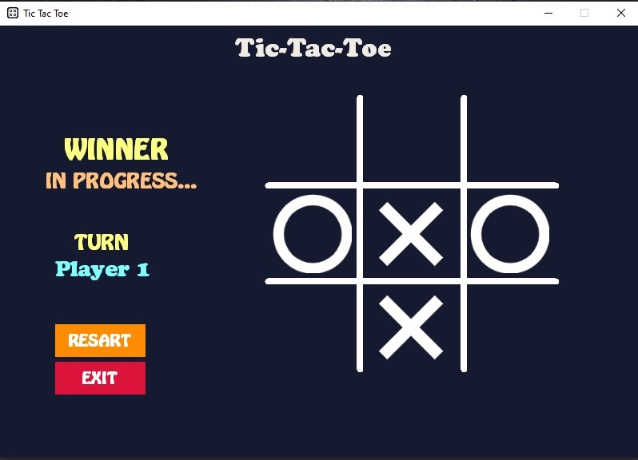

# Tic Tac Toe

* A classic Tic Tac Toe built using .NET Forms with C#. 
* This application allows two players to play the game on a Windows Forms interface. 
* The game tracks turns, detects winners or draw, and provides a simple and interactive UX.

---

---

## Features
1. Two-player mode
2. Real-time win detection (rows, columns, diagonals)
3. Reset button to restart the game
4. User-friendly Windows Forms UI
5. Highlighting winning moves

## Installation
1. Clone the repository.
2. Open the project in Visual Studio.
3. Build and run the system.

